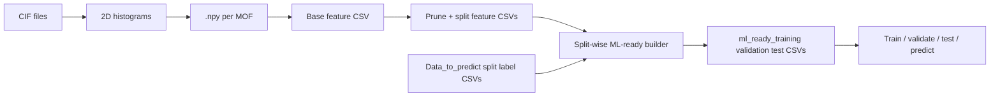

# 2D histogram MOF representation

This project builds a fixed-length **per-MOF feature vector** from crystal structures (CIF). For each structure, `2D_Histogram.py` computes three 2D histograms (grid-point neighbors binned by distance vs. charge, distance vs. Lennard-Jones ε, and distance vs. σ). Their density channels are concatenated into one array (`Avg_Density`), which is the **MOF representation** used for machine learning.

End-to-end flow:



`mof_2d_features.py` writes one base CSV; `prune_feature_columns.py` prunes columns on that table and writes training/validation/testing feature CSVs aligned with `Data_to_predict/`; `build_ml_ready_data.py` then creates final split-wise ML-ready tables by combining MOF representations with adsorption scenario columns.

---

## 1. Environment

From the project root:

```bash
pip install -r requirements.txt
```

Main dependencies: NumPy, pandas, ASE, Matplotlib, MDAnalysis, SciPy. The histogram code also uses the local module `PerodicKDtree_NAMD.py`.

---

## 2. Generate 2D histograms (structures → `.npy`)

### Option A — one CIF (interactive / debugging)

`2D_Histogram.py` is the core implementation. Its `main()` function reads a CIF, builds the histograms, and optionally writes NumPy archives under `2DOutput/<cif_basename>/` (`Avg_Density.npy` is the flattened representation).

Adjust the `cif=` path and flags in the `if __name__ == "__main__"` block at the bottom of `2D_Histogram.py`, or import `main` from another script.

With `exportdata=True`, outputs include:

- `2DOutput/<name>/Avg_Density.npy` — vector used as ML features  
- `2DOutput/<name>/Avg_all_xyz.npy` — analysis array X and Y x 3 (Eps, Q, Sigma) 

### Option B — many CIFs (high-throughput)

Use `batch_cif_2d.py` so every structure is processed with `2D_Histogram.py`:

```bash
python batch_cif_2d.py --cif-dir path/to/cifs --no-plot --copy-to-npys npys
```

- **`--cif-dir`**: folder of `.cif` files (add `--recursive` to walk subfolders).  
- **`--no-plot`**: skip Matplotlib figures (recommended for batches).  
- **`--copy-to-npys npys`**: copy each `Avg_Density.npy` to `npys/<MOF_stem>.npy` so all descriptors live in one flat folder.  
- **`--grid-distance`**: 3D grid spacing in Å (default `1.0`; you can use `0.5` for finer or `2.0` for coarser grids).  
- **`--distance-bin-step`**: distance-axis bin width in Å (default `1.0`).  
- **`--double-distance-binning`**: halve the effective distance-bin step (for example, `1.0 -> 0.5`) to double distance-binning resolution.  
- Other options match the histogram driver: `--cutoff`, `--search-radius-ratio`, etc. (`--help` for full list).

Failures are reported per file; successful runs populate `2DOutput/` and optionally `npys/`.

---

## 3. Base feature table — all `.npy` → one CSV (`mof_2d_features.py`)

`mof_2d_features.py` writes **exactly one** CSV: every MOF row and every column `feature_0` … `feature_{N-1}` (Fortran-flattened `Avg_Density` order). It does **not** prune columns and does **not** split by train/validation/test — that is step 3.5.

```bash
python mof_2d_features.py \
  --npy-folder npys \
  --output MOF_2D_features.csv \
  --manifest MOF_2D_features.manifest.json
```

Alternatives:

- Read directly from histogram export trees: `--histogram-mode 2doutput --2doutput-root 2DOutput` (no `npys/` copy needed).

Optional **`--manifest`**: JSON with feature dimension and column names.

Console summary (example): `Wrote MOF_2D_features.csv  (N MOFs × F features)`.

---

## 3.5. Prune columns + train/val/test feature CSVs (`prune_feature_columns.py`)

After step 3, run this **once** on the base CSV. It:

1. Loads the full table and **prunes feature columns** using `--min-std` and/or `--zero-tol` (standard deviation and all-(near)-zero rules are evaluated on the **full** table so all three splits share the **same** feature columns and types).
2. Splits **rows** by `MOF_name` using the split files under `Data_to_predict/` (defaults: `training_base.csv`, `validation_base.csv`, `test_base.csv`).
3. Writes three CSVs next to each other: `<stem>_training.csv`, `<stem>_validation.csv`, `<stem>_test.csv`.
Note: The data in the paper for loading predictions removed all the zero columns and the columns with standard deviation less than 0.032

```bash
python prune_feature_columns.py \
  -i MOF_2D_features.csv \
  --splits-dir Data_to_predict \
  --min-std 0.0 \
  --zero-tol 0.0
```

By default outputs are named `MOF_2D_features_pruned_training.csv` (and `_validation`, `_test`) beside `MOF_2D_features.csv`. Override the prefix with `--output-stem path/to/my_features_pruned`.

You must pass **at least one** of `--min-std` or `--zero-tol`. Optional **`--manifest`**: writes one JSON sidecar per split (`*_training.json`, etc.). The script prints a **`[prune]`** line (rows and feature count before/after) and a **`[split:…]`** line per split (rows × features, plus split/matched/missing MOF counts).

---

## 4. Recommended split pipeline: build ML-ready tables (`build_ml_ready_data.py`)

After generating split-specific pruned feature files in step 3.5, use this script as the standard project pipeline for model-ready datasets.

It reads:

- `Data_to_predict/training_base.csv`, `validation_base.csv`, `test_base.csv`
- `MOF_2D_features_pruned_training.csv`, `_validation.csv`, `_test.csv`

and writes:

- `ml_ready_training.csv`
- `ml_ready_validation.csv`
- `ml_ready_test.csv`

Each output row has:

1. `MOF_name`
2. all `feature_*` columns (MOF representation)
3. adsorption scenario columns:
   - `LPD, PLD, SA_grav, VF, PSSD, density, fugacity, chg, bond_length, eps_eff, sig_eff, loading`
   - plus `ads` for test

Anything else in `Data_to_predict/*_base.csv` is discarded.

```bash
python build_ml_ready_data.py
```

Build only selected splits:

```bash
python build_ml_ready_data.py --split training --split validation
```

Useful options:

- `--repo-root` project root override
- `--mof-column` MOF id column (default `MOF_name`)
- `--feature-prefix` feature column prefix (default `feature_`)
- `--chunksize` chunked CSV size for large label files
- `--unmatched-report` write MOFs from labels without feature matches
- `--keep-chg-suffix` keep `_CHG` suffix during MOF name normalization

---

## 4.5. Custom merge workflow (`attach_mof_features_to_labels.py`)

This is a flexible helper for non-standard datasets. It combines **any label CSV** (with a MOF identifier column) with feature vectors. You choose which label columns to keep; the MOF id column is enforced if omitted from the list.

```bash
python attach_mof_features_to_labels.py \
  --features-csv MOF_2D_features.csv \
  --labels Data_to_predict/train_set_omar.csv \
  --keep MOF_name,Loading,ads \
  --output train_with_2dhist.csv \
  --unmatched-report train_missing_features.csv
```

- **`--features-csv`**: output from step 3 (full table) or from step 3.5 (e.g. `*_pruned_training.csv` when merging labels for that split only).  
  Or skip the CSV and pass **`--features-from-npys npys`** / **`--features-from-2doutput 2DOutput`** to build the same matrix on the fly.  
- **`--keep`**: comma-separated columns to preserve from the label file.  
- **`--keep-all`**: keep every label column, then append features.  
- **`--mof-column`**: MOF identifier column name (default `MOF_name`).  
- **`--unmatched-report`**: optional CSV of label MOFs with no matching `.npy` / feature row.

Matching normalizes names (strips `.cif`, optional `_CHG` suffix) so CIF stems and spreadsheet names align.

---
## 4.8. Optional: list MOFs per split

To quickly inspect which MOFs are present in your `train/validation/test` label splits, you can extract unique `MOF_name` values into three CSVs.

```bash
python extract_mof_split_lists.py --splits-dir Data_to_predict
```

By default it expects:
- `test_base.csv`
- `validation_base.csv`
- `training_base.csv`

It writes:
- `mof_split_lists/test_mofs.csv`
- `mof_split_lists/validation_mofs.csv`
- `mof_split_lists/training_mofs.csv`

---

## 5. Pipeline spirit (recommended mindset)

The project is designed as a **single consistent descriptor pipeline**:

1. Compute one physics-based MOF representation (`Avg_Density.npy` per structure).
2. Convert all MOFs to one aligned feature matrix (`MOF_2D_features.csv`).
3. Prune columns once on the full matrix so all splits share the same feature schema.
4. Build split-wise ML-ready tables with only:
   - `MOF_name`
   - pruned MOF representation (`feature_*`)
   - adsorption scenario fields (and `ads` for test)

This keeps feature ordering stable across training/validation/test and prevents accidental leakage from extra columns.

---

## 6. Machine learning (outside this repo)

The file from step 4 is a standard tabular dataset:

- **Inputs**: columns `feature_*` (and optionally other preserved descriptors you kept from the label CSV).  
- **Targets**: whichever label columns you retained (e.g. `Loading`, classification `ads`, etc.).

Use scikit-learn, PyTorch, JAX, or any other stack: train/validate/test directly from `ml_ready_training.csv`, `ml_ready_validation.csv`, and `ml_ready_test.csv` generated in step 4. If you use the custom path in step 4.5 instead, keep the **same pruned feature column set** across splits (step 3.5 ensures identical `feature_*` columns in `*_training`, `*_validation`, `*_test`) so feature dimension and ordering stay consistent.

---

## File map

| Piece | Role |
|--------|------|
| `2D_Histogram.py` | Physics / binning; single-structure entry point |
| `PerodicKDtree_NAMD.py` | Periodic neighbor search used by the histogram |
| `batch_cif_2d.py` | Batch CIF → `2DOutput/` (+ optional `npys/`) |
| `mof_2d_features.py` | All `.npy` → **one** full MOF × feature CSV |
| `prune_feature_columns.py` | Prune columns on full CSV → three split CSVs (`*_training`, `*_validation`, `*_test`) |
| `build_ml_ready_data.py` | Recommended split-wise builder: pruned features + `Data_to_predict/*_base.csv` → `ml_ready_*.csv` |
| `extract_mof_split_lists.py` | Optional: unique `MOF_name` lists per split file |
| `attach_mof_features_to_labels.py` | Flexible custom label CSV + features merge helper |
| `utils.py` | Shared utilities (optional for other analyses) |

---

## Typical directory layout after a run

```
2DOutput/              # per-structure exports from the histogram
  <structure>.cif/
    Avg_Density.npy
npys/                  # optional flat copies for step 3
  <structure>.npy
MOF_2D_features.csv    # from mof_2d_features.py (single base table, all features)
*_pruned_*.csv         # from prune_feature_columns.py (training / validation / testing)
ml_ready_training.csv  # from build_ml_ready_data.py
ml_ready_validation.csv
ml_ready_test.csv
*_with_2dhist.csv      # from attach_mof_features_to_labels.py
```

---

## Authorship

| Component | Notes |
|-----------|--------|
| **2D histogram MOF descriptor** | Implemented in `2D_Histogram.py` (distance–charge, distance–ε, distance–σ density maps on a grid, GenericMOF-style LJ parameters).|
| **Batching & ML table pipeline** | `batch_cif_2d.py`, `mof_2d_features.py`, `prune_feature_columns.py`, `attach_mof_features_to_labels.py`, and this documentation: *Fernando* is the current repository maintainer. |
| **Periodic neighbor search** | `PerodicKDtree_NAMD.py` (custom periodic CKD tree) alongside **MDAnalysis**’s `PeriodicKDTree` in `2D_Histogram.py`. |

Authors
*J. Fernando Fajardo-Rojas, Colorado School of Mines*
*Tsung-Wei Liu, Colorado School of Mines*
*Omar MAnsurov, Colorado School of Mines*
*Diego A. Gómez-Gualdrón, Colorado School of Mines*

---

## Citation

When you use this workflow in a paper, thesis, or report, cite **(1)** and **(2)** for the primary research that defines the 2D-histogram representation (once you have a DOI), and **(3)** for this software if appropriate.

### 1. Primary method (peer-reviewed)

```bibtex
@article{IterativeMLMOFNH3,
  title   = {MOFs to Enhance Green NH3 Synthesis in Plasma Reactors: Hierarchical Computational Screening Enhanced by Iterative Machine Learning},
  author  = {Liu, T.W., Fajardo-Rojas, F., Addish, S., Martinez, E., Gómez-Gualdrón, D.A.},
  journal = {ACS Appl. Mater. Interfaces},
  year    = {2024},
  doi     = {https://doi.org/10.1021/acsami.4c11396}
}
```
### 2. Primary method (peer-reviewed)

```bibtex
@article{2DhisLoadHK,
  title   = {Two-dimensional interaction parameter histograms as a simple and versatile nanoporous material representation for machine learning prediction of adsorption properties},
  author  = {Gercina de Vilas, T., Fajardo-Rojas, F., Mansurov, O., Devashier, R., Toberer, E., Gómez-Gualdrón, D.A.},
  journal = {Under-review},
  year    = {2026},
  doi     = {...}
}
```
### 3. This software

```bibtex
@software{MOF2DHistogramSoftware,
  title  = {2D Histogram MOF Representation: descriptor generation and ML-ready tables},
  author = {Fajardo-Rojas, F., Liu, T.W., Gómez-Gualdrón, D.A.},
  year   = {2026},
  url    = {....},
  note   = {Includes 2D\_Histogram.py batch pipeline and feature/label merge tools}
}
```